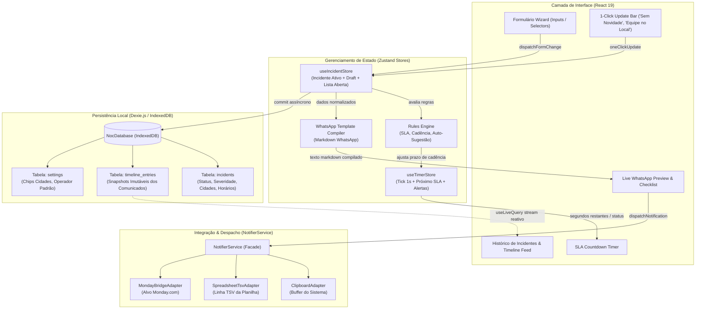
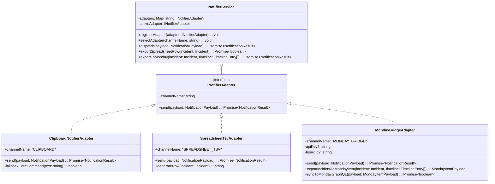
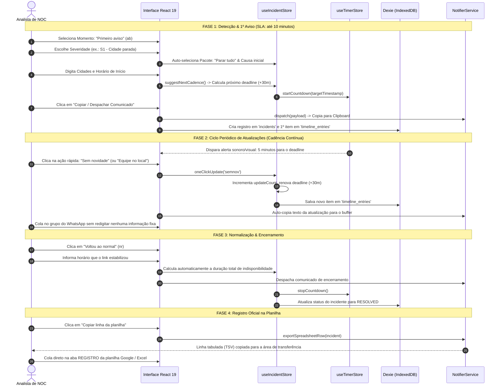

# NOC Incident Dispatcher — Arquitetura de Software & Guia Técnico

> **Projeto:** NOC Incident Dispatcher (Grupo IBL)  
> **Versão:** 2.0.0 (Migração e Modernização Arquitetural)  
> **Autor:** Senior Front-end Engineer / Software Architect  
> **Status:** Fundação Arquitetural & Especificação Técnica Aprovada  
> **Stack:** React 19 · TypeScript 5.x (Strict) · Vite · Tailwind CSS · Zustand · Dexie.js (IndexedDB)

---

## 1. Visão Geral & Motivação Operacional

### 1.1. O Desafio no Front de Batalha do NOC
Em operações de rede e telecomunicações de missão crítica (como as do **NOC Grupo IBL**), o tempo entre a identificação de um evento de massa e a comunicação às equipes de atendimento, lojas e clientes é decisivo. 

O lema inegociável da operação é:
> **"A regra que não se quebra:** todo aviso termina com a hora do próximo — e esse próximo é mandado mesmo quando não há novidade. **'Sem novidade' já é uma resposta.** O que deixa o time perdido é o silêncio."

### 1.2. Diagnóstico da Aplicação Legada (`index.html`)
A versão legada baseada em um único arquivo monolítico de HTML/JS puro cumpriu seu papel inicial, mas acumulou gargalos operacionais e técnicos severos:

| Aspecto | Legado (`index.html`) | Novo NOC Incident Dispatcher |
| :--- | :--- | :--- |
| **Persistência de Dados** | `localStorage` frágil para apenas **1** evento (`noc.ev`). Se houver múltiplos incidentes simultâneos (ex.: queda em Paragominas e lentidão em Tomé-Açu), os dados colidem ou são destruídos. | **Dexie.js (IndexedDB)** com schemas versionados, permitindo múltiplos incidentes simultâneos, rascunhos e busca em histórico. |
| **Ciclo de Atualização** | O analista precisava checar formulários, revisar cidades e reescrever partes do texto a cada 30/60 minutos, arriscando erros em momentos de crise. | **"Ciclo de Atualização em 1 Clique"**: dados imutáveis são preservados; basta clicar no novo andamento ("Sem novidade", "Equipe no local") e o despacho é gerado instantaneamente. |
| **Linha do Tempo (Timeline)** | Inexistente. O analista apenas incrementava um contador numérico (`updates`) sem saber o que foi enviado 2 horas atrás. | **Timeline Auditável**: cada despacho gera um registro histórico imutável com snapshot do texto enviado, operador e horário. |
| **Gestão de SLA e Prazos** | Cálculo pontual de horário estático (`hh:mm`), sem cronômetro reativo, sem avisos de proximidade de estouro de SLA. | **Timer Reativo & Rules Engine**: relógio regressivo com alertas visuais/sonoros calculados dinamicamente com base na severidade (SA/S1 = 30m, S2 = 60m, S3 = 120m). |
| **Integração & Despacho** | Cópia estrita para Clipboard do navegador. | **`NotifierService` Desacoplado**: padrão Strategy focado em **Clipboard nativo otimizado (Operator-in-the-Loop)** como canal oficial do paliativo, exportador tabular para planilha TSV e ponte arquitetural pronta para o **Monday.com** (software corporativo de documentação de eventos da empresa), eliminando a complexidade, instabilidade e custos de APIs de WhatsApp. |
| **Arquitetura & Tipagem** | Código imperativo, sem tipagem estática, manipulando DOM diretamente por IDs e `className`. | **React 19 + TypeScript Estrito + Zustand**: renderização reativa, componentes atômicos desacoplados e estado centralizado e previsível. |

---

## 2. Taxonomia & Regras de Domínio Extraídas do Legado

Todas as constantes, regras de cadência e matrizes de decisão presentes no código legado foram catalogadas e preservadas integralmente na nova arquitetura, agora de forma tipada e imutável.

### 2.1. Matriz de Severidades (`SEVERITY_CONFIG`)

| ID | Código | Nome Formal / Técnico | Ícone | Cor Token | Cadência (SLA) | Regra / Comportamento Especial |
| :--- | :--- | :--- | :---: | :--- | :---: | :--- |
| `SA` | **SA** | Incidente de Segurança Cibernética (DDoS) | 🟣 | `--purple` (`#A78BFA`) | **30 min** | Ataque volumétrico / aplicação. Habilita telemetria técnica (L7/DNS/volumetria) e mitigação. Auto-seleciona Causa `ataque` e Pacote `agenda`. |
| `S1` | **S1** | Indisponibilidade Total (Blackout / Cidade Parada) | 🔴 | `--red` (`#EF5B5B`) | **30 min** | Interrupção generalizada em município ou POP central. Auto-seleciona Pacote `tudo` (paralisar novas ativações e visitas). |
| `S2` | **S2** | Indisponibilidade Parcial / Setorial | 🟠 | `--amber` (`#F0A742`) | **60 min** | Interrupção concentrada em bairro, anel óptico ou distrito. Auto-seleciona Pacote `agenda` (suspender agendamentos). |
| `S3` | **S3** | Degradação de Desempenho / Instabilidade | 🟡 | `--amber` (`#F0A742`) | **120 min** | Degradação de latência, jitter ou perda de pacotes. Altera textos de causa para foco em instabilidade/lentidão. Auto-seleciona Pacote `avisar`. |
| `S4` | **S4** | Manutenção Programada / Janela de Mudança | 🔵 | `--signal` (`#35D1B8`) | **Início / Fim** | Intervenção planejada e homologada previamente. Avisos restritos ao início e conclusão da janela. |

### 2.2. Momentos do Comunicado (`MOMENTS`)

1. `ab` (**Primeiro Aviso** - 📣): Enviado em até 10 minutos após detecção, mesmo com causa desconhecida ("Em apuração").
2. `at` (**Atualização** - 🔄): Enviado rigorosamente no prazo prometido, preservando dados imutáveis e destacando o que mudou.
3. `nr` (**Voltou ao normal** - ✅): Enviado em até 10 minutos após validação de retorno real do tráfego. Calcula automaticamente o tempo de indisponibilidade decorrido.
4. `en` (**Relatório final** - 📋): Enviado pós-incidente / dia seguinte. Consolida causa raiz, tempo total de impacto, ações corretivas e preventivas.

### 2.3. Catálogo de Causas (`CAUSES`)

```typescript
export const CAUSES_CATALOG: readonly CauseDefinition[] = [
  {
    id: 'energia',
    icon: '🔌',
    label: 'Faltou energia',
    category: 'Falta de energia',
    textFullOutage: 'Os clientes estão sem internet porque faltou energia na região.',
    textSlowDegraded: 'A internet está instável porque faltou energia em parte da rede.',
    immediateAction: 'Os geradores já estão ligados e estamos acompanhando a volta da energia.',
    technicalCause: 'Queda de energia da concessionária',
    finalReportSummary: 'Faltou energia na região e o fornecimento demorou mais do que a autonomia das nossas baterias.'
  },
  {
    id: 'fibra',
    icon: '✂️',
    label: 'Cabo rompido',
    category: 'Rompimento de fibra',
    textFullOutage: 'Um cabo nosso foi rompido e os clientes ficaram sem internet.',
    textSlowDegraded: 'Um cabo nosso foi rompido e a internet está instável enquanto desviamos o sinal.',
    immediateAction: 'A equipe já está a caminho do local para emendar o cabo.',
    technicalCause: 'Rompimento de fibra',
    finalReportSummary: 'Um cabo da nossa rede foi rompido e precisou ser emendado no local.'
  },
  {
    id: 'obra',
    icon: '🚧',
    label: 'Obra de terceiro',
    category: 'Obra de terceiro',
    textFullOutage: 'Uma obra de terceiros rompeu nosso cabo e os clientes ficaram sem internet.',
    textSlowDegraded: 'Uma obra de terceiros danificou nosso cabo e a internet está instável.',
    immediateAction: 'A equipe já está a caminho do local para refazer o trecho danificado.',
    technicalCause: 'Rompimento por obra de terceiro',
    finalReportSummary: 'Uma obra de terceiros na via rompeu nosso cabo, sem aviso prévio.'
  },
  {
    id: 'equip',
    icon: '🖥️',
    label: 'Equipamento com defeito',
    category: 'Falha de equipamento',
    textFullOutage: 'Um equipamento nosso apresentou defeito e derrubou a internet dos clientes.',
    textSlowDegraded: 'Um equipamento nosso apresentou defeito e a internet está instável.',
    immediateAction: 'Já identificamos o equipamento e estamos trocando agora.',
    technicalCause: 'Falha de equipamento',
    finalReportSummary: 'Um equipamento da nossa rede falhou e precisou ser substituído.'
  },
  {
    id: 'operadora',
    icon: '🏢',
    label: 'Problema na operadora',
    category: 'Falha da operadora',
    textFullOutage: 'A operadora que fornece nosso link está com problema e os clientes ficaram sem internet.',
    textSlowDegraded: 'A operadora que fornece nosso link está com problema e a internet está lenta.',
    immediateAction: 'Já abrimos chamado e estamos acompanhando a operadora minuto a minuto.',
    technicalCause: 'Falha no link da operadora',
    finalReportSummary: 'A operadora que fornece nosso link teve uma falha fora da nossa rede.'
  },
  {
    id: 'ataque',
    icon: '🛡️',
    label: 'Ataque de fora',
    category: 'Ataque',
    textFullOutage: 'Estamos sofrendo um ataque de fora que está derrubando a internet dos clientes.',
    textSlowDegraded: 'Estamos sofrendo um ataque de fora e a internet está lenta por causa disso.',
    immediateAction: 'Estamos bloqueando o ataque junto com a operadora e o acesso vai voltando aos poucos.',
    technicalCause: 'Ataque externo',
    finalReportSummary: 'Nossa rede foi alvo de um ataque vindo de fora, que sobrecarregou os equipamentos.'
  },
  {
    id: 'manut',
    icon: '🔧',
    label: 'Manutenção programada',
    category: 'Manutenção programada',
    textFullOutage: 'Vamos mexer na rede para uma manutenção já programada e a internet vai ficar fora nesse período.',
    textSlowDegraded: 'Estamos fazendo uma manutenção programada e a internet pode oscilar nesse período.',
    immediateAction: 'A manutenção está em andamento dentro do horário combinado.',
    technicalCause: 'Manutenção programada',
    finalReportSummary: 'Foi uma manutenção programada, avisada com antecedência.'
  },
  {
    id: 'sistema',
    icon: '📱',
    label: 'App ou central fora',
    category: 'Outro',
    textFullOutage: 'Nosso aplicativo e a central de atendimento estão fora do ar. A internet dos clientes não foi afetada.',
    textSlowDegraded: 'Nosso aplicativo e a central de atendimento estão lentos. A internet dos clientes não foi afetada.',
    immediateAction: 'A equipe de sistemas já está trabalhando para restabelecer.',
    technicalCause: 'Indisponibilidade de sistema interno',
    finalReportSummary: 'Um sistema interno ficou indisponível, sem afetar a internet dos clientes.'
  },
  {
    id: 'nsei',
    icon: '❓',
    label: 'Ainda não sabemos',
    category: 'Outro',
    textFullOutage: 'Os clientes estão sem internet e ainda estamos verificando o motivo.',
    textSlowDegraded: 'A internet está lenta e ainda estamos verificando o motivo.',
    immediateAction: 'Ainda estamos verificando o que causou. Assim que descobrirmos, aviso aqui.',
    technicalCause: 'Em apuração',
    finalReportSummary: 'A causa foi apurada durante o atendimento e está descrita abaixo.'
  }
] as const;
```

### 2.4. Andamentos Rápidos (`PROGRESS_STATUSES`)

| ID | Ícone | Título Curto | Frase Compilada |
| :--- | :---: | :--- | :--- |
| `procurando` | 🔍 | Ainda procurando | *Continuamos procurando a causa. Assim que encontrarmos, aviso aqui.* |
| `achou` | 🎯 | Já achamos o problema | *Já encontramos o que causou e estamos corrigindo agora.* |
| `campo` | 🚚 | Equipe chegou no local | *Nossa equipe chegou no local e começou a correção.* |
| `voltando` | 📈 | Já está voltando | *Estamos voltando para o cenário de normalidade. Alguns clientes ainda podem estar com dificuldade em algum acesso.* |
| `semnov` | ⏳ | Sem novidade | *Sem novidade desde o último aviso. Continuamos trabalhando no problema.* |
| `piorou` | ⚠️ | Piorou ou aumentou | *O problema aumentou e agora afeta uma área maior. Estamos reforçando a equipe.* |
| `prazo` | 🕐 | O prazo mudou | *Vamos precisar de mais tempo do que o previsto. O novo prazo está abaixo.* |
| `quase` | 🏁 | Está terminando | *A correção está na fase final. Em breve mando a confirmação de que voltou.* |

### 2.5. Pacotes de Ação para o Time (`ACTION_PACKAGES`)

* **`igual`** (🔁 Segue igual ao aviso anterior): Disponível exclusivamente no momento de Atualização (`at`).
* **`nada`** (🟢 Nada muda): Todos seguem a rotina normal.
* **`avisar`** (🔵 Só avisar o cliente):
  * Atendimento: explicar com a frase única padronizada, sem abrir chamado técnico.
  * Lojas e vendas: podem marcar e instalar normalmente.
  * Equipe de rua: rotina normal.
* **`agenda`** (🟠 Parar agendamento nas cidades afetadas):
  * Atendimento: explicar com a frase padronizada, sem abrir chamado técnico.
  * Lojas e vendas: **não** marcar instalação nas cidades afetadas.
  * Equipe de rua: não precisa deslocar, o problema não é na casa do cliente.
* **`tudo`** (🔴 Parar tudo na região até novo aviso):
  * Atendimento: explicar com a frase padronizada, sem abrir chamado técnico.
  * Lojas e vendas: **não** marcar instalação, ativação nem visita nas cidades afetadas.
  * Equipe de rua: não deslocar. Quem já estiver em rota para lá, retornar imediatamente.

---

## 3. Arquitetura de Dados & Tipagem TypeScript (Modo Estrito)

A modelagem reflete o ciclo de vida real de incidentes de rede, separando o **Incidente Mestre** (entidade persistente com estado que transiciona de `OPEN` para `RESOLVED`) dos **Despachos de Timeline** (registros imutáveis de eventos de comunicação).

### 3.1. Entidades Principais (`src/types/domain.ts`)

```typescript
/**
 * Identificadores fortes do sistema
 */
export type IncidentId = string; // UUID v4 ou NanoID
export type TimelineEntryId = string;
export type SeverityId = 'SA' | 'S1' | 'S2' | 'S3' | 'S4';
export type MomentType = 'ab' | 'at' | 'nr' | 'en';
export type CauseId = 'energia' | 'fibra' | 'obra' | 'equip' | 'operadora' | 'ataque' | 'manut' | 'sistema' | 'nsei';
export type ProgressStatusId = 'procurando' | 'achou' | 'campo' | 'voltando' | 'semnov' | 'piorou' | 'prazo' | 'quase';
export type ActionPackageId = 'igual' | 'nada' | 'avisar' | 'agenda' | 'tudo';

export type IncidentLifecycleStatus = 'OPEN' | 'MONITORING' | 'RESOLVED' | 'CLOSED';

/**
 * Detalhes técnicos para registro interno de engenharia / operadora.
 * Não vão para o comunicado público do grupo geral.
 */
export interface TechnicalDetails {
  popOrSegment: string; // Ex: "POP Paragominas / bloco 177.54.x"
  technicalCause: string; // Ex: "Falha de equipamento" ou "Queda concessionária"
  ddosInfo?: {
    attackType: 'Ainda identificando' | 'Volumétrico (saturação de banda)' | 'Amplificação (DNS, NTP, memcached)' | 'Camada de aplicação (L7)' | 'Ataque ao DNS recursivo';
    observedVolume: string; // Ex: "12 Gbps / 2 Mpps"
    appliedMitigation: 'Filtro no upstream' | 'Blackhole do IP alvo junto à operadora' | 'Scrubbing acionado' | 'Rate limit e bloqueio de origem' | 'Em avaliação com a operadora';
  };
}

/**
 * Entidade Raiz: Incidente
 */
export interface Incident {
  id: IncidentId;
  codeNumber: string; // Ex: "INC-202609-001"
  status: IncidentLifecycleStatus;
  severity: SeverityId;
  causeId: CauseId;
  
  // Localidades e Clientes
  affectedLocations: string[]; // Cidades ou bairros (ex: ["Paragominas", "Ulianópolis"])
  clientCountEstimate: string; // Ex: "cerca de 1.000" ou "ainda estamos levantando"
  
  // Marcos Temporais (ISO 8601 Strings para serialização determinística)
  detectedAt: string; // Momento que o NOC tomou conhecimento
  incidentStartedAt: string; // Horário real relatado de início do evento
  firstAnnouncementAt?: string; // Horário de disparo do 1º aviso
  nextDeadlineAt?: string; // Horário limite para o próximo comunicado
  resolvedAt?: string; // Horário de normalização da rede
  closedAt?: string; // Horário de encerramento e emissão do relatório final
  
  // Métricas
  totalDurationFormatted?: string; // Calculado automaticamente (ex: "3 horas e 20 minutos")
  updateCount: number; // Contador acumulativo de despachos 'at'
  
  // Detalhamento Técnico
  technicalDetails: TechnicalDetails;
  
  // Última Mensagem Padronizada ao Cliente
  customerFacingGuidance?: string;
  
  createdAt: string;
  updatedAt: string;
}

/**
 * Registro de Despacho Histórico (Timeline)
 * Imutável após o envio.
 */
export interface TimelineEntry {
  id: TimelineEntryId;
  incidentId: IncidentId;
  moment: MomentType;
  sequenceNumber: number; // 1 (1º aviso), 2, 3...
  
  // Contexto do Momento
  severitySnapshot: SeverityId;
  progressStatusId?: ProgressStatusId;
  actionPackageId: ActionPackageId;
  
  // Conteúdos Formatados
  compiledMarkdown: string; // Texto final formatado para WhatsApp
  internalNotes?: string;
  
  // Auditoria
  operatorName: string;
  dispatchedAt: string;
  dispatchedVia: 'CLIPBOARD' | 'MONDAY_BRIDGE' | 'SPREADSHEET_TSV';
  nextCadencePromisedAt?: string;
}

/**
 * Estrutura de Rascunho em Memória (Zustand Form State)
 */
export interface DispatchDraft {
  incidentId?: IncidentId;
  moment: MomentType;
  severity: SeverityId;
  causeId: CauseId;
  progressStatusId: ProgressStatusId;
  actionPackageId: ActionPackageId;
  
  // Inputs Dinâmicos
  citiesRaw: string;
  whatIsHappening: string;
  whatWeAreDoing: string;
  estimatedReturn: string;
  whatChanged: string;
  recoveredPortion: string;
  whatReturned: string;
  clientInstructions: string;
  whatWeDid: string;
  whatChangesForFuture: string;
  extraOrientation: string;
  customerScript: string;
  
  // Timings
  incidentStartedTime: string; // "HH:mm"
  recoveryTime: string; // "HH:mm"
  manualDuration: string;
  nextAnnouncementTime: string; // "HH:mm"
  operatorName: string;
  
  // Detalhes Técnicos
  techCause: string;
  techLocation: string;
  ddosType: string;
  ddosVolume: string;
  ddosMitigation: string;
  
  // Planilha Sync
  spreadsheetEndedAt: string; // datetime-local
}
```

---

## 4. Arquitetura de Camadas (Folder Structure)

A estrutura adota o princípio de separação limpa de responsabilidades, isolando componentes de apresentação, regras puras de negócio, persistência IndexedDB e integrações externas:

```
noc-incident-dispatcher/
├── architecture.archify.json        # Especificação formal da topologia do sistema
├── README.md                        # Documentação técnica e arquitetural (este arquivo)
├── index.html                       # Entry point SPA com metas PWA e viewport segura
├── package.json
├── tsconfig.json                    # TypeScript estrito (noUncheckedIndexedAccess, strict: true)
├── vite.config.ts                   # Bundler Vite configurado com aliasing e PWA
├── tailwind.config.ts               # Paleta estendida com tokens de cores do NOC
│
├── src/
│   ├── main.tsx                     # Bootstrap da aplicação
│   ├── App.tsx                      # App Shell e orquestrador de modais
│   │
│   ├── assets/                      # Ícones e sons de alerta de SLA
│   │   └── alert-beep.mp3
│   │
│   ├── constants/                   # Tabelas estáticas extraídas do legado
│   │   ├── severities.ts            # SA, S1, S2, S3, S4
│   │   ├── moments.ts               # ab, at, nr, en
│   │   ├── causes.ts                # Catálogo de causas completas
│   │   ├── progress.ts              # Andamentos (sem novidade, equipe no local, etc.)
│   │   ├── packages.ts              # Pacotes de ação e orientações
│   │   └── presets.ts               # Frases prontas (L_CLIENTES, L_PREV, L_OQUE, etc.)
│   │
│   ├── types/                       # Contratos e modelos TypeScript estritos
│   │   ├── domain.ts                # Incident, TimelineEntry, TechnicalDetails
│   │   ├── catalog.ts               # Tipagem dos catálogos
│   │   └── notifier.ts              # Interfaces do serviço de despacho
│   │
│   ├── db/                          # Camada de Persistência IndexedDB (Dexie.js)
│   │   ├── schema.ts                # Definição de tabelas, índices e versionamento
│   │   ├── database.ts              # Instância singleton Dexie: NocDatabase
│   │   └── repositories/            # Camada de acesso a dados
│   │       ├── incidentRepository.ts
│   │       └── timelineRepository.ts
│   │
│   ├── store/                       # Camada de Estado Global (Zustand)
│   │   ├── useIncidentStore.ts      # Gerencia incidente ativo, rascunhos e lista de abertos
│   │   ├── useTimerStore.ts         # Cronômetro de SLA reativo e relógio regressivo
│   │   └── useSettingsStore.ts      # Preferências do operador e chips de cidades
│   │
│   ├── rules/                       # Regras de Negócio e Compilação Pura
│   │   ├── slaCalculator.ts         # Cálculo de cadência e prazos por severidade
│   │   ├── templateCompiler.ts      # Compilação e formatação Markdown para WhatsApp
│   │   ├── durationCalculator.ts    # Cálculo de horas/minutos entre marcos temporais
│   │   └── checklistValidator.ts    # Validador de campos obrigatórios por momento
│   │
│   ├── services/                    # Integrações e Adapters (Strategy Pattern)
│   │   ├── notifier/
│   │   │   ├── NotifierService.ts   # Fachada de despacho
│   │   │   ├── INotifierAdapter.ts  # Contrato de interface
│   │   │   ├── ClipboardAdapter.ts  # Cópia para área de transferência (Canal Oficial)
│   │   │   ├── SpreadsheetAdapter.ts# Formatação e cópia de TSV para planilha
│   │   │   └── MondayBridgeAdapter.ts# Ponte para sincronização com Monday.com (Futuro)
│   │   └── storage/
│   │       └── memorySync.ts        # Sincronização entre IndexedDB e Zustand
│   │
│   ├── hooks/                       # Custom Hooks React
│   │   ├── useActiveIncident.ts     # Hook com reatividade de liveQuery do Dexie
│   │   ├── useSlaCountdown.ts       # Hook de contagem regressiva e alertas de áudio
│   │   ├── useOneClickUpdate.ts     # Encapsula o ciclo rápido de 1 clique
│   │   └── useKeyboardShortcuts.ts  # Atalhos (Ctrl+Enter para copiar/despachar)
│   │
│   ├── components/
│   │   ├── layout/                  # Estrutura visual
│   │   │   ├── Navbar.tsx
│   │   │   ├── AppShell.tsx
│   │   │   └── MobileBottomBar.tsx  # Dock flutuante mobile ("Ver Mensagem" / "Copiar")
│   │   │
│   │   ├── incident/                # Componentes do Incidente
│   │   │   ├── ActiveIncidentBanner.tsx  # Banner superior com status e quick actions
│   │   │   ├── IncidentSwitcher.tsx      # Alternância entre múltiplos incidentes abertos
│   │   │   ├── SlaCountdownWidget.tsx    # Relógio regressivo com anel visual
│   │   │   └── OneClickActionBar.tsx     # Botões de andamento rápido
│   │   │
│   │   ├── form/                    # Formulário Wizard
│   │   │   ├── MomentSelector.tsx        # Etapa 1: ab, at, nr, en
│   │   │   ├── SeveritySelector.tsx      # Etapa 2: SA, S1, S2, S3, S4
│   │   │   ├── CauseSelector.tsx         # Etapa 3: grade de causas
│   │   │   ├── ProgressSelector.tsx      # Etapa 3b: grade de andamentos
│   │   │   ├── DynamicFieldsStep.tsx     # Etapa 4: campos condicionais por momento
│   │   │   ├── ActionPackageStep.tsx     # Etapa 5: pacotes para os times
│   │   │   ├── TechnicalDetailsAccordion.tsx # Etapa extra: POP, OLT, DDoS
│   │   │   └── OperatorFooterStep.tsx    # Etapa 6: Operador e Hora do Próximo
│   │   │
│   │   ├── preview/                 # Visualização e Despacho
│   │   │   ├── LiveWhatsAppPreview.tsx   # Bolha de chat escura com markdown nativo
│   │   │   ├── ChecklistBadgeList.tsx    # Indicadores de campos pendentes
│   │   │   └── DispatchActionGroup.tsx   # Botões Copiar, Limpar, Enviar Webhook
│   │   │
│   │   ├── timeline/                # Histórico
│   │   │   ├── IncidentTimeline.tsx      # Feed vertical de despachos
│   │   │   └── TimelineItemCard.tsx      # Card de despacho histórico individual
│   │   │
│   │   └── ui/                      # Design System Base
│   │       ├── Card.tsx             # Card retrátil com header clicável e toggle icon
│   │       ├── Chip.tsx             # Chips reutilizáveis para cidades/POPs recentes
│   │       ├── Badge.tsx
│   │       └── Modal.tsx
│   │
│   └── utils/                       # Utilitários puros
│       ├── dateFormatter.ts         # Formatação HH:mm e DD/MM/YYYY
│       ├── stringUtils.ts
│       └── audioAlert.ts            # Disparador de som de alerta Web Audio API
```

---

## 5. Pipeline de Estado e Persistência Unidirecional

A aplicação opera sob um modelo **Offline-First**, no qual todas as transações são garantidas localmente no IndexedDB via Dexie.js e espelhadas em memória no Zustand para renderizações de 60fps sem engasgos.



### 5.1. O Conceito de "Ciclo de Atualização em 1 Clique"
No fluxo legado, a cada 30 minutos o analista precisava refazer etapas, correndo o risco de alterar cidades ou esquecer dados cruciais. Na nova arquitetura:

1. **Herança Automática:** O incidente ativo no Zustand e Dexie retém como imutáveis: `cidades`, `horarioInicio`, `severidade`, `causa` e `detalhesTecnicos`.
2. **Ativação Rápida:** Ao chegar o horário da cadência (ou disparar o alarme de SLA), o analista clica em um botão na barra de acesso rápido:
   * 🟢 *Sem novidade*
   * 🚚 *Equipe chegou no local*
   * 🎯 *Já achamos o problema*
   * 📈 *Já está voltando*
3. **Execução Atômica:** A store executa a transição em uma única operação:
   * Define o momento como `at` (Atualização).
   * Injeta a frase do andamento no campo `mudou`.
   * Mantém o pacote de ação como `igual` (*Segue igual ao aviso anterior*).
   * Incrementa o contador de atualizações (`updateCount++`).
   * Calcula o próximo deadline somando a cadência da severidade atual (ex.: +30 min) arredondada para o próximo múltiplo de 5 minutos.
   * Compila o novo markdown.
   * Grava uma nova entrada na tabela `timeline_entries`.
   * Aciona o `NotifierService` para copiar automaticamente o texto compilado para a área de transferência.

---

## 6. Motor de Compilação de Templates para WhatsApp

O gerador compila os dados estruturados no formato rigoroso aceito pelo WhatsApp (`*negrito*`, `_itálico_`, marcadores `•`), respeitando as regras visuais estabelecidas pelo NOC Grupo IBL.

### 6.1. Algoritmo de Compilação (`src/rules/templateCompiler.ts`)

```typescript
import { DispatchDraft, Incident, SeverityId, MomentType } from '../types/domain';
import { SEVERITIES_MAP } from '../constants/severities';
import { ACTION_PACKAGES_MAP } from '../constants/packages';

export interface CompilationResult {
  text: string;
  isComplete: boolean;
  missingFields: string[];
}

export function compileWhatsAppMessage(
  draft: DispatchDraft,
  incident?: Incident | null
): CompilationResult {
  const lines: string[] = [];
  const missing: string[] = [];
  const sevConfig = SEVERITIES_MAP[draft.severity];
  const isMaintenance = draft.severity === 'S4';
  const now = new Date();
  const dateFormatted = `${String(now.getDate()).padStart(2, '0')}/${String(now.getMonth() + 1).padStart(2, '0')}`;
  const timeFormatted = `${String(now.getHours()).padStart(2, '0')}:${String(now.getMinutes()).padStart(2, '0')}`;

  // 1. Cabeçalho e Título Principal
  let title = 'ESTAMOS COM UM PROBLEMA';
  let icon = sevConfig.ico;

  if (isMaintenance) {
    if (draft.moment === 'ab') title = 'MANUTENÇÃO PROGRAMADA';
    if (draft.moment === 'at') title = 'ATUALIZAÇÃO DA MANUTENÇÃO';
    if (draft.moment === 'nr') title = 'MANUTENÇÃO CONCLUÍDA';
  } else {
    if (draft.moment === 'at') title = 'ATUALIZAÇÃO';
    if (draft.moment === 'nr') { title = 'VOLTOU AO NORMAL'; icon = '🟢'; }
    if (draft.moment === 'en') { title = 'O QUE ACONTECEU'; icon = '📋'; }
  }

  lines.push(`${icon} *${title}*`);

  // Subtítulo descritivo
  if (draft.moment === 'ab' && !isMaintenance) {
    lines.push(`_${sevConfig.label}_`);
  } else if (draft.moment === 'at') {
    const contextLabel = isMaintenance ? 'Manutenção marcada' : sevConfig.label;
    const locationSuffix = draft.citiesRaw.trim() ? ` · ${draft.citiesRaw.trim()}` : '';
    lines.push(`_${contextLabel}${locationSuffix}_`);
  } else if (draft.moment === 'en') {
    const endFormatted = draft.spreadsheetEndedAt
      ? `${draft.spreadsheetEndedAt.slice(8, 10)}/${draft.spreadsheetEndedAt.slice(5, 7)}`
      : '';
    const subParts = [draft.citiesRaw.trim(), endFormatted].filter(Boolean);
    if (subParts.length) lines.push(`_${subParts.join(' · ')}_`);
  }

  lines.push(''); // Linha em branco separadora

  // 2. Corpo Conforme o Momento
  if (draft.moment === 'ab') {
    if (!draft.citiesRaw.trim()) missing.push('Cidades ou bairros afetados');
    if (!draft.whatIsHappening.trim()) missing.push('O que está acontecendo');
    if (!draft.incidentStartedTime.trim()) missing.push('Horário de início');
    if (!draft.whatWeAreDoing.trim()) missing.push('O que já estamos fazendo');

    if (draft.whatIsHappening) lines.push(`*O que está acontecendo:* ${draft.whatIsHappening}`);
    if (draft.citiesRaw) lines.push(`*Onde:* ${draft.citiesRaw}`);
    if (draft.recoveredPortion || draft.whatIsHappening) {
      // Clientes afetados
      if (incident?.clientCountEstimate) lines.push(`*Clientes afetados:* ${incident.clientCountEstimate}`);
    }
    if (draft.incidentStartedTime) lines.push(`*Começou:* ${draft.incidentStartedTime}`);
    lines.push('');
    if (draft.whatWeAreDoing) lines.push(`*O que já estamos fazendo:* ${draft.whatWeAreDoing}`);
    
    if (draft.severity === 'SA') {
      lines.push('*Previsão de voltar:* o bloqueio está em andamento e o acesso deve melhorar aos poucos.');
    } else if (draft.estimatedReturn) {
      lines.push(`*Previsão de voltar:* ${draft.estimatedReturn}`);
    }
  }

  if (draft.moment === 'at') {
    if (!draft.whatChanged.trim()) missing.push('O que mudou desde o último aviso');
    
    if (draft.whatChanged) lines.push(`*O que mudou:* ${draft.whatChanged}`);
    if (draft.recoveredPortion) lines.push(`*Quanto já voltou:* ${draft.recoveredPortion}`);
    if (draft.severity === 'SA') {
      lines.push('*Previsão de voltar:* o bloqueio está em andamento e o acesso deve melhorar aos poucos.');
    } else if (draft.estimatedReturn) {
      lines.push(`*Previsão de voltar:* ${draft.estimatedReturn}`);
    }
  }

  if (draft.moment === 'nr') {
    if (!draft.whatReturned.trim()) missing.push('O que voltou');
    if (!draft.citiesRaw.trim()) missing.push('Onde');
    if (!draft.recoveryTime.trim()) missing.push('Que horas voltou');

    if (draft.whatReturned) lines.push(`*O que voltou:* ${draft.whatReturned}`);
    if (draft.citiesRaw) lines.push(`*Onde:* ${draft.citiesRaw}`);
    if (draft.recoveryTime) lines.push(`*Voltou às:* ${draft.recoveryTime}`);
    if (draft.manualDuration) lines.push(`*Ficou fora:* ${draft.manualDuration}`);
    if (draft.clientInstructions) {
      lines.push('');
      lines.push(`*O cliente precisa saber:* ${draft.clientInstructions}`);
    }
  }

  if (draft.moment === 'en') {
    if (!draft.whatIsHappening.trim()) missing.push('O que aconteceu');
    if (!draft.whatWeDid.trim()) missing.push('O que fizemos');
    if (!draft.whatChangesForFuture.trim()) missing.push('O que muda para o futuro');

    if (draft.whatIsHappening) lines.push(`*O que aconteceu:* ${draft.whatIsHappening}`);
    if (draft.manualDuration) lines.push(`*Quanto tempo durou:* ${draft.manualDuration}`);
    if (incident?.clientCountEstimate) lines.push(`*Clientes afetados:* ${incident.clientCountEstimate}`);
    lines.push('');
    if (draft.whatWeDid) lines.push(`*O que fizemos:* ${draft.whatWeDid}`);
    if (draft.whatChangesForFuture) lines.push(`*O que muda daqui pra frente:* ${draft.whatChangesForFuture}`);
  }

  // 3. O que muda para o time (Pacotes de Ação)
  if (draft.moment === 'ab' || draft.moment === 'at') {
    const pkg = ACTION_PACKAGES_MAP[draft.actionPackageId];
    lines.push('');
    if (!pkg || pkg.id === 'igual') {
      lines.push('*O que muda para o time:* segue igual ao aviso anterior.');
    } else if (pkg.lines.length) {
      lines.push(`*O que muda para o time:* ${pkg.title}`);
      pkg.lines.forEach((l) => lines.push(`• ${l}`));
    } else {
      lines.push('*O que muda para o time:* nada, todo mundo segue a rotina normal.');
    }

    if (draft.extraOrientation.trim()) {
      lines.push(`• _Atenção:_ ${draft.extraOrientation.trim()}`);
    }

    if (draft.customerScript.trim() && !(draft.moment === 'at' && draft.actionPackageId === 'igual')) {
      lines.push('');
      lines.push('*Se o cliente perguntar, diga:*');
      lines.push(`"${draft.customerScript.trim()}"`);
    }
  } else if (draft.moment === 'nr') {
    lines.push('');
    lines.push('*Já pode voltar ao normal:*');
    lines.push('• _Atendimento:_ atender normalmente.');
    lines.push('• _Lojas e vendas:_ podem marcar instalação e ativação de novo.');
    lines.push('• _Equipe de rua:_ rotina normal.');
    if (draft.extraOrientation.trim()) {
      lines.push(`• _Atenção:_ ${draft.extraOrientation.trim()}`);
    }
  }

  // 4. Rodapé e Próxima Cadência
  lines.push('');
  if (draft.moment === 'nr') {
    lines.push(
      isMaintenance
        ? '✅ *Manutenção concluída.* Está tudo funcionando normalmente.'
        : '✅ *Problema encerrado.* Amanhã mando o resumo do que aconteceu.'
    );
  } else if (draft.moment === 'en') {
    lines.push('📋 *Resumo final.* Dúvidas, é só chamar o NOC.');
  } else if (draft.nextAnnouncementTime) {
    lines.push(`⏱️ *Próximo aviso até ${draft.nextAnnouncementTime}* — mando mesmo se não tiver novidade.`);
  } else if (draft.severity === 'S4') {
    lines.push('⏱️ *Aviso no início e no fim da manutenção.*');
  } else {
    missing.push('Hora do próximo aviso');
    lines.push('⏱️ *Falta preencher a hora do próximo aviso.*');
  }

  if (!draft.operatorName.trim()) missing.push('Nome do operador');
  const operatorTag = draft.operatorName.trim() ? `${draft.operatorName.trim()} · NOC` : 'NOC';
  lines.push(`_${operatorTag} · ${dateFormatted} ${timeFormatted}_`);
  lines.push('');
  lines.push('🔒 *USO INTERNO — NÃO ENCAMINHAR EM NENHUMA HIPÓTESE*');

  return {
    text: lines.join('\n').replace(/\n{3,}/g, '\n\n'),
    isComplete: missing.length === 0,
    missingFields: missing
  };
}
```

---

## 7. Camada de Integração: `NotifierService` & Alinhamento Estratégico

### 7.1. Decisão Arquitetural: Por que NÃO usar API de WhatsApp no Paliativo?
O **NOC Incident Dispatcher** nasce com um propósito bem definido: é uma **solução tática e paliativa de alta produtividade** para eliminar o erro humano e o retrabalho operacional imediato do time de NOC, enquanto a solução corporativa definitiva integrada ao **Monday.com** (software oficial de documentação de eventos da empresa) é desenvolvida.

A decisão de **não** conectar uma API de WhatsApp (Evolution API, Z-API, Baileys, etc.) neste momento baseia-se em critérios sólidos de engenharia:
1. **Zero Sobrecarga de Infraestrutura:** APIs não-oficiais de WhatsApp exigem servidores dedicados, monitoramento de sessões com QR Code (que frequentemente caem no meio de crises de rede), proxies e risco real de banimento de chips corporativos.
2. **Eliminação de Desperdício (Princípio YAGNI):** Investir tempo de desenvolvimento e manutenção em conectores de WhatsApp descartáveis geraria dívida técnica, já que o ecossistema definitivo convergirá para o **Monday.com**.
3. **Controle Humano (Operator-in-the-Loop):** O analista copia a mensagem compilada com 1 clique (ou atalho `Ctrl+Enter`) e a cola no grupo oficial com revisão instantânea. Nenhuma mensagem é disparada de forma cega ou imprevisível.

### 7.2. Padrão Strategy & Arquitetura de Saída

O `NotifierService` foi construído com o padrão **Strategy**, permitindo que a aplicação seja 100% autossuficiente via **Clipboard nativo** e **Linha TSV de Planilha**, deixando pronta a ponte de dados estruturada para o **Monday.com**:



### 7.3. Contrato da Interface (`src/types/notifier.ts`)

```typescript
export interface NotificationPayload {
  incidentId: string;
  moment: MomentType;
  compiledMarkdown: string;
  targetGroupName?: string; // Default: "Avisos - Eventos Massivos"
  operatorName: string;
  metadata: {
    severity: string;
    cities: string[];
    updateCount: number;
    nextDeadline?: string;
  };
}

export interface NotificationResult {
  success: boolean;
  channel: string;
  timestamp: string;
  messageId?: string;
  errorMessage?: string;
}

export interface INotifierAdapter {
  readonly channelName: string;
  send(payload: NotificationPayload): Promise<NotificationResult>;
}
```

### 7.4. Alinhamento com Monday.com (Ponte Estrutural de Dados)
Para garantir que este projeto paliativo sirva como alavanca direta para a futura integração definitiva com o Monday, todas as entidades (`Incident` e `TimelineEntry`) mapeiam perfeitamente para colunas típicas de um Board de Incidentes do Monday.com:

| Propriedade do Dispatcher | Coluna no Quadro do Monday.com | Tipo de Coluna Monday |
| :--- | :--- | :--- |
| `codeNumber` | Nome do Item | **Item Name** |
| `severity` | Gravidade / Severidade (SA, S1, S2, S3, S4) | **Status** |
| `status` | Status do Evento (Aberto, Monitorando, Resolvido) | **Status** |
| `causeId` | Causa Raiz Apurada | **Dropdown / Status** |
| `affectedLocations` | Cidades / Bairros Impactados | **Tags / Text** |
| `detectedAt` | Data/Hora de Detecção | **Date & Time** |
| `resolvedAt` | Data/Hora de Normalização | **Date & Time** |
| `totalDurationFormatted` | MTTR / Tempo Total de Indisponibilidade | **Numbers / Text** |
| `updateCount` | Quantidade de Comunicados Emitidos | **Numbers** |
| `TimelineEntry[]` | Histórico Completo de Comunicados com Timestamp e Operador | **Item Updates (Activity Feed)** |

O `MondayBridgeAdapter` fornecerá:
1. **Exportação com 1 Clique de Payload JSON:** Exporta o incidente pronto para consumo por automações no Monday via Webhook.
2. **Integração GraphQL Direta (Opcional):** Disparo assíncrono via `mutation { create_item(...) }` na API v2 do Monday quando a chave de API for informada nas configurações locais da aplicação.

---

## 8. Workflow Operacional do Analista NOC (Passo a Passo)



---

## 9. Paleta de Cores e Tokens Tailwind CSS

A fidelidade visual em relação ao `index.html` original é mantida por meio de tokens no `tailwind.config.ts`, projetados especificamente para salas de controle com iluminação reduzida:

```typescript
// tailwind.config.ts
import type { Config } from 'tailwindcss';

export default {
  darkMode: 'class',
  content: ['./index.html', './src/**/*.{ts,tsx}'],
  theme: {
    extend: {
      colors: {
        noc: {
          bg: '#0B1015',          // Fundo principal ultra dark
          surface: '#121922',     // Superfície dos cards
          surface2: '#182130',    // Inputs, caixas secundárias e botões inativos
          border: '#232E3D',      // Bordas sutis de contraste
          
          text: '#E7EDF4',        // Texto primário legível
          textDim: '#8C99AB',     // Texto secundário/instruções
          textFaint: '#5B6779',   // Texto desabilitado/rodapé
          textDark: '#06201B',     // Texto de alto contraste sobre fundo signal
          
          signal: '#35D1B8',      // Teal / Ciano IBL (Destaque principal)
          signalDim: 'rgba(53, 209, 184, 0.12)',
          
          amber: '#F0A742',       // Alerta, S2, relógio de atenção
          amberDim: 'rgba(240, 167, 66, 0.12)',
          
          red: '#EF5B5B',         // Crítico, S1, falta grave, erro de SLA
          redDim: 'rgba(239, 91, 91, 0.12)',
          
          purple: '#A78BFA',      // Ataques DDoS, incidentes SA
          purpleDim: 'rgba(167, 139, 250, 0.12)',
        }
      },
      fontFamily: {
        sans: ['-apple-system', 'BlinkMacSystemFont', '"Segoe UI"', 'Roboto', 'Arial', 'sans-serif'],
        mono: ['"SF Mono"', 'Consolas', '"Liberation Mono"', 'Menlo', 'monospace'],
      }
    }
  },
  plugins: []
} satisfies Config;
```

---

## 10. Próximos Passos de Implementação (Roadmap)

1. **Setup do Projeto:** Inicialização do Vite com React 19 + TypeScript (`vite create . --template react-ts`) e configuração do Tailwind CSS.
2. **Implementação da Camada de Domínio e Banco:** Criação das constantes (`severities.ts`, `causes.ts`, `packages.ts`) e schema Dexie (`src/db/schema.ts`).
3. **Stores Zustand:** Implementação de `useIncidentStore` e `useTimerStore`.
4. **Construção dos Componentes de UI:** Montagem do formulário retrátil, preview de mensagem, relógio de SLA e timeline.
5. **Testes de Usabilidade do Analista:** Validação do fluxo de 1-Click Update e precisão dos textos compilados em Markdown.
