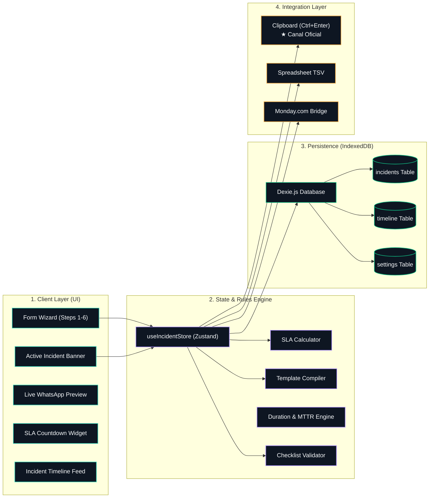
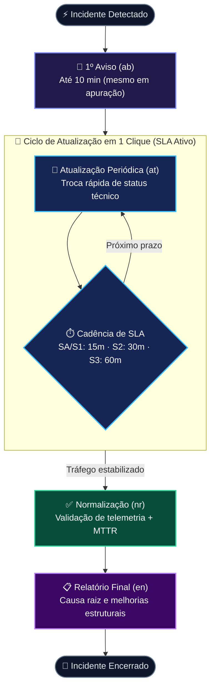
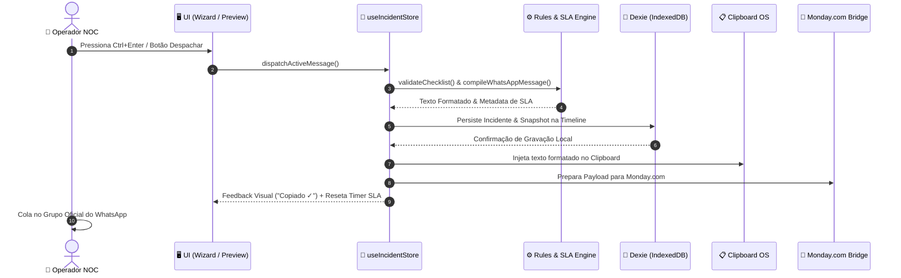

<div align="center">

# ⚡ NOC Incident Dispatcher

**Sistema Reativo de Gestão e Despacho de Incidentes de Rede**  
*Grupo IBL · Network Operations Center (NOC)*

[](https://react.dev)
[-3178C6?style=flat-square&logo=typescript&logoColor=white)](https://www.typescriptlang.org)
[](https://vitejs.dev)
[](https://tailwindcss.com)
[](https://github.com/pmndrs/zustand)
[](https://dexie.org)
[](./architecture.archify.json)

</div>

---

## 🏛️ Topologia Arquitetural (Archify Specification)

<p align="center">
  
</p>

<details open>
<summary><b>🔍 Diagrama Interativo de Fluxo (Mermaid Flowchart)</b></summary>



</details>

---

## ⚡ Especificação Rápida das Camadas

<table>
  <thead>
    <tr>
      <th align="left">Camada</th>
      <th align="left">Tecnologia</th>
      <th align="left">Responsabilidade</th>
      <th align="left">Saída / Artefato</th>
    </tr>
  </thead>
  <tbody>
    <tr>
      <td><b>1. Client Presentation</b></td>
      <td><code>React 19</code> · <code>Tailwind CSS</code></td>
      <td>Interface Dark Command Center, inputs desacoplados, preview hiper-realista do WhatsApp Web e relógio reativo.</td>
      <td>DOM reativo, Hotkeys (<code>Ctrl+Enter</code>)</td>
    </tr>
    <tr>
      <td><b>2. State & Engine</b></td>
      <td><code>Zustand 5</code> · <code>TypeScript</code></td>
      <td>Gerenciamento de rascunhos, cronômetro de cadência (SLA), cálculo de MTTR e compilação do texto formal.</td>
      <td>State imutável, string formatada WhatsApp</td>
    </tr>
    <tr>
      <td><b>3. Persistence</b></td>
      <td><code>Dexie.js</code> (IndexedDB)</td>
      <td>Armazenamento local multi-incidente no navegador. Protege contra perda por reload acidental (F5) ou fechamento de abas.</td>
      <td>Schemas: <code>incidents</code>, <code>timeline</code>, <code>settings</code></td>
    </tr>
    <tr>
      <td><b>4. Integration</b></td>
      <td><code>Strategy Pattern</code></td>
      <td>Saída operacional de alta velocidade: Clipboard nativo (paliativo sem custos de API) e ponte para Monday.com.</td>
      <td>Clipboard OS, Linha TSV, Payload Monday API</td>
    </tr>
  </tbody>
</table>

---

## 🚨 Matriz de Classificação & SLAs

<table>
  <thead>
    <tr>
      <th>Código</th>
      <th>Nomenclatura Técnica Formal</th>
      <th>SLA Obrigatório</th>
      <th>Diretriz Operacional IBL</th>
    </tr>
  </thead>
  <tbody>
    <tr>
      <td align="center">🔴 <b>S1</b></td>
      <td><b>Indisponibilidade</b></td>
      <td><code>A cada 15 min</code></td>
      <td>Queda total de município ou POP principal. Suspensão total de agendas de rua e ativações.</td>
    </tr>
    <tr>
      <td align="center">🟠 <b>S2</b></td>
      <td><b>Indisponibilidade Parcial</b></td>
      <td><code>A cada 30 min</code></td>
      <td>Interrupção isolada a anéis ópticos, bairros específicos ou trechos de cabo.</td>
    </tr>
    <tr>
      <td align="center">🟡 <b>S3</b></td>
      <td><b>Instabilidade</b></td>
      <td><code>A cada 60 min</code></td>
      <td>Degradação de tráfego, latência ou perda de pacotes. Orientar suporte com frase única.</td>
    </tr>
    <tr>
      <td align="center">🔵 <b>S4</b></td>
      <td><b>Manutenção Programada</b></td>
      <td><code>Início e Fim</code></td>
      <td>Janela noturna técnica previamente homologada pelo NOC.</td>
    </tr>
    <tr>
      <td align="center">🟣 <b>SA</b></td>
      <td><b>Incidente de Segurança (DDoS)</b></td>
      <td><code>A cada 15 min</code></td>
      <td>Ataque volumétrico/L7. Habilita telemetria e registros de mitigação de operadora/upstream.</td>
    </tr>
  </tbody>
</table>

---

## 🔄 Ciclo de Vida do Incidente (*Operator-in-the-Loop*)

<details open>
<summary><b>🔍 Diagrama de Fases Operacionais</b></summary>



</details>

---

## 📡 Pipeline de Despacho & Dados



---

## 💾 Persistência: IndexedDB vs Hospedagem Centralizada

> [!NOTE]
> **Como funciona atualmente:**  
> O sistema utiliza **IndexedDB (Dexie.js)**. Os dados residem **no navegador do computador do operador**. Se a máquina fechar a aba ou reiniciar, nada se perde.  
> Se o projeto for hospedado estaticamente em `https://event.iblnet.com.br/`, outro usuário que abrir o link em sua máquina iniciará com o banco local vazio.

Para tornar o link um **Painel de Monitoramento Global em Tempo Real**, utiliza-se:
1. **Monday.com API:** Através do [`MondayBridgeAdapter.ts`](./src/services/notifier/MondayBridgeAdapter.ts), os eventos alimentam o quadro central da IBL.
2. **Camada em Nuvem (Supabase / Firebase):** Sincronização via WebSockets refletindo novos comunicados em menos de 100ms em todas as telas abertas.

---

## 🛠️ Execução & Comandos

```bash
# 1. Instalar dependências
npm install

# 2. Servidor de desenvolvimento com HMR
npm run dev

# 3. Compilar bundle de produção otimizado
npm run build

# 4. Preview local do pacote gerado (dist/)
npm run preview
```

---

<div align="center">

<sub>Grupo IBL · Network Operations Center · Arquitetura Orientada a Eventos Críticos</sub>

</div>
